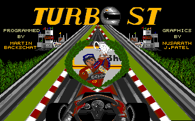
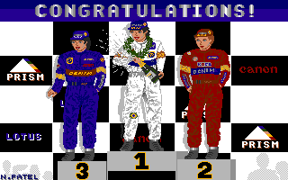

# Turbo ST - Game Manual

## About

**Turbo ST** is a racing game for the Atari ST, created in 1987.

- **Publisher**: Prism PLC  
- **Conversion**: Capital Software Developments Ltd  
- **Programmer**: Martin Backschat

Turbo ST combines a track editor with a pseudo-3D racing experience. Design your own circuits using the built-in editor, then race on them with up to 4 players.

## System Requirements

- Atari ST computer (520ST or higher)
- Color monitor (low resolution, 320x200, 16 colors)
- Joystick (port 1)
- Single-sided floppy disk drive

## Getting Started

1. Insert the Turbo ST disk into drive A
2. Double-click `TURBOST.PRG` from the GEM desktop, or set it as an AUTO-run program
3. The title screen appears with music - press any key to continue


4. You are now in the Track Editor

## The Track Editor


The Track Editor is the main screen where you design race tracks. It shows:

### Screen Layout

```
+--------------------------------------------------+
| LOAD | SAVE | CLEAR | SCENERY | PLAY | QUIT      |  <- Command buttons
+--------------------------------------------------+
|                                                    |
|           18 x 9 Grid (Playfield)                  |  <- Place track pieces here
|                                                    |
+--------------------------------------------------+
|  Track Components (19 selectable pieces)           |  <- Click to select
+--------------------------------------------------+
```

### Placing Track Pieces

1. **Select a component**: Click on one of the track pieces at the bottom of the screen. The selected piece flashes briefly to confirm selection.
2. **Place it on the grid**: Click anywhere in the 18x9 playfield to place the selected component at that position.
3. **Build a closed loop**: Your track must form a complete circuit. It needs at least one start piece (component #9 or #18) and all pieces must connect properly.

### The 18 Track Components

The components include:
- **Straight pieces**: Horizontal, vertical, and diagonal roads
- **Curves**: Various curve radii (gentle and sharp) in all directions
- **Start piece**: Where the race begins and the lap counter triggers (components #9 and #18)

Each piece connects to adjacent pieces using 8 possible directions:
```
  NW  N  NE
    \ | /
 W - * - E
    / | \
  SW  S  SE
```

### Command Buttons

#### LOAD
Opens a file browser showing all files in the current directory. Navigate through the file list and type a filename to load a previously saved track. The associated high scores (.TOP file) are loaded automatically.

#### SAVE
Saves the current track to disk. Type a filename when prompted. Two files are created:
- The track data file (your chosen name)
- A high scores file (same name with .TOP extension)

#### CLEAR
Erases the entire playfield. The button flashes to confirm. All track pieces are removed.

#### SCENERY


Opens the scenery selection menu. Choose from three visual themes:

| # | Scenery | Description |
|---|---------|-------------|
| 1 | **Rising Sun/City** | Warm sunset colors with city skyline |
| 2 | **High Noon/City** | Displayed as "High Noon" but uses Alps color palette (see note) |
| 3 | **Alps/Village** | Displayed as "Alps" but uses High Noon color palette (see note) |

> **Note**: Due to a palette mapping quirk in the original code, sceneries 2 and 3 have their color palettes and background bitmaps swapped compared to their menu labels. The "High Noon/City" selection actually renders with cool Alpine colors, and "Alps/Village" renders with bright midday colors. This is consistent in the original game.

Use the **cursor up/down keys** to navigate and **Return** to confirm.

#### PLAY
Starts a race on the current track. The track must have a valid closed circuit with a start piece.

#### QUIT
Exits Turbo ST and returns to the GEM desktop.

### File Browser

When loading or saving, the file browser:
- Lists up to 23 files from the current directory (in two columns for more)
- Shows filenames in the directory
- Prompts "Enter name:" at the bottom
- Type the filename (up to 12 characters) and press Return
- Backspace deletes the last character

## Racing

### Pre-Race Setup


After pressing PLAY, you'll be asked two questions:

#### Number of Laps (1-9)
- Use **joystick left/right** to decrease/increase
- Press the **fire button** to confirm
- The selection text pulses in color

#### Number of Players (1-4)
- Use **joystick left/right** to decrease/increase  
- Press the **fire button** to confirm
- Players take turns racing one at a time

### The Racing Screen


```
+--------------------------------------------------+
|              Sky / Scenery (scrolls)               |
+--------------------------------------------------+
|         Road with perspective rendering            |
|     [ Roadside signs appear here ]                 |
+--------------------------------------------------+
| Score: XXXX | Lap X/Y |  Steering  | Speed | Gear |
+--------------------------------------------------+
```

The dashboard (HUD) shows:
- **Score** (top-left of dashboard): 4-digit score, starts at 9998, counts down
- **Lap counter**: Current lap / Total laps
- **Steering wheel**: Visual representation of your steering input (9 positions)
- **Speedometer**: Current speed displayed as a gauge
- **Gear indicator**: Shows current gear (1-4)

### Controls (Joystick)

| Input | Action |
|-------|--------|
| **Up** | Accelerate (increase RPM) |
| **Down** | Brake (decrease speed) |
| **Left** | Steer left |
| **Right** | Steer right |
| **Fire + Up** | Shift up (when RPM is at maximum) |
| **Fire + Down** | Shift down (when RPM is at minimum) |

### Driving Tips

#### Speed and Gears
- There are **4 gears** (1-4). You start in gear 1.
- Each gear has 4 RPM levels. Rev up to maximum RPM before shifting.
- To shift up: Hold **fire** and push **up** when RPM is at max (3).
- To shift down: Hold **fire** and push **down** when RPM is at min (0).
- Higher gears allow faster speeds. The speedometer shows your actual speed.

#### Steering
- The steering wheel auto-centers when you release left/right.
- On curves, the road naturally pushes your car toward the edge - counter-steer!
- The steering response is tighter when you're actively steering into a curve.
- If you drift without steering, the car slides more dramatically.

#### Road Edges
- The road has colored edges (alternating stripes) that indicate track boundaries.
- Driving on the edge causes friction and gradually slows you down.
- Going too far off the road (past the edge) causes a crash!

### Crashes


A crash happens when:
- Your car goes too far off the road (horizontal offset exceeds limit)
- You collide with a roadside billboard/sign

When you crash:
1. An explosion animation plays with fire effects
2. You lose **30 points** from your score
3. Your car resets to the center of the road
4. Speed and gear reset to zero
5. You must accelerate again from standstill

### Signs/Billboards

Roadside signs appear periodically along the track:
- **4 sign types**: Prism Leisure logo, ST advertisement, Capital Software, GO!
- Signs appear on either side of the road
- They grow larger as you approach (perspective scaling from small to large)
- **Beware**: Signs can cause crashes if you're too far off-center!

### Scoring

- Score starts at **9998** for each player
- Score decreases by **2 points** every 3 frames (roughly every 0.06 seconds at 50Hz)
- **Crash penalty**: -30 points
- The goal is to complete all laps with the highest remaining score
- Score cannot go below 0000
- Faster completion = higher score (less time = less score decay)

### Pause and Abort

- **Space bar**: Pauses the game. A pause screen is displayed with music. Press Space again to resume.
- **Undo key** (ESC equivalent on Atari ST): Aborts the current race and returns to the editor.

### Game Over

After completing all laps:
1. "GAME OVER - PLAYER X" is displayed with pulsing colors
2. Press the fire button to advance to the next player (or to scores)
3. After all players finish, high scores are checked

## High Scores

### How High Scores Work

- High scores are only recorded for **1-lap races**
- Up to **6 entries** per track
- After all players finish, scores are compared against the existing leaderboard
- If a player's score ranks in the top 6, they are prompted to enter their name

### Entering Your Name

When you achieve a high score:
1. Your rank and player number are displayed
2. "Please enter your name for the Xth rank." appears
3. Type your name (up to **16 characters**)
4. Press **Return** to confirm
5. Backspace deletes the last character

### Champion Screen



If you achieve the **#1 rank**, a special champion screen is displayed!

### High Score Display

After score processing:
- The high score screen (`hiscore.pi1`) is displayed as background
- All 6 ranked entries are shown with names and scores
- Music plays during the display
- Press the **fire button** to return to the Track Editor

### Score Persistence

High scores are saved automatically to the `.TOP` file associated with the track. The default track's scores are in `default.top`.

### Track File Details

- Track files are exactly **164 bytes**: 162 bytes of grid data + 2 bytes for the scenery selection
- High score files (`.TOP`) are ~206 bytes of ASCII text with 6 ranked entries
- There is no enforced file extension for tracks; you can name them anything
- The `.TOP` extension is automatically derived by replacing or appending `.TOP` to your track filename

## Sceneries in Detail

### Rising Sun/City (Scenery 1)
A warm-toned sunset cityscape. The palette (`scen1pal`) emphasizes reds, oranges, and yellows ($761, $750, $740...). The sky scrolls to show a city skyline silhouette against a gradient sunset.

### High Noon/City (Scenery 2)
Labeled as "High Noon" in the selection menu, but due to a palette/bitmap swap in the code, it actually uses the **Alps palette** (`scen3pal`) with cool blues, grays, and earth tones ($136, $237, $320...). The background bitmap also comes from the Alps scenery source. This produces a cooler, more dramatic visual than the name suggests.

### Alps/Village (Scenery 3)
Labeled as "Alps" in the menu, but actually uses the **High Noon palette** (`scen2pal`) with brighter blues and greens ($235, $245, $467...). The background shows a brighter mountain village scene. This is effectively the "bright daytime" experience despite the Alpine label.

## Technical Notes

- The game runs in Atari ST low resolution (320x200, 16 colors)
- Frame rate is tied to the 50Hz (PAL) or 60Hz (NTSC) vertical blank
- The game auto-detects 50/60Hz and adjusts timing accordingly
- Tracks are stored as compact binary files (164 bytes per track)
- The game uses double-buffered rendering for smooth animation
- A raster split effect provides two independent color palettes: one for the sky and one for the road/dashboard

## Files on Disk

| File | Purpose |
|------|---------|
| TURBOST.PRG | Main game executable |
| TITLE.PI1 | Title screen image |
| DASHBORD.PI1 | Dashboard/cockpit graphics and sprites |
| TRCS.PI1 | Track editor background |
| SIGNS.PI1 | Roadside billboard sprites (set 1) |
| SIGNS2.PI1 | Roadside billboard sprites (set 2) + scenery data |
| FILM.PI1 | Crash/explosion animation frame |
| HISCORE.PI1 | High score screen background |
| CHAMPION.PI1 | Champion celebration screen |
| HEAVY.SEQ | Title/pause music |
| EXPL.SND | Explosion sound effect |
| DEFAULT | Default track layout |
| DEFAULT.TOP | Default track high scores |
| EASY | Easy track layout |
| EASY.TOP | Easy track high scores |
| DEVIL | Devil (hard) track layout |
| DEVIL.TOP | Devil track high scores |

## Quick Reference Card

```
EDITOR:
  Left-click component  -> Select it
  Left-click grid        -> Place selected component
  LOAD/SAVE/CLEAR/SCENERY/PLAY/QUIT -> Command buttons at top

RACING:
  Joystick Up          -> Accelerate
  Joystick Down        -> Brake  
  Joystick Left/Right  -> Steer
  Fire + Up            -> Shift gear up
  Fire + Down          -> Shift gear down
  Space                -> Pause
  Undo (ESC)           -> Abort race
  
MENUS:
  Joystick Left/Right  -> Change selection
  Fire button          -> Confirm
  Cursor Up/Down       -> Scenery selection
  Return               -> Confirm text input
```

---

*Turbo ST (c) 1987 Prism PLC. Conversion by Capital Software Developments Ltd.*
